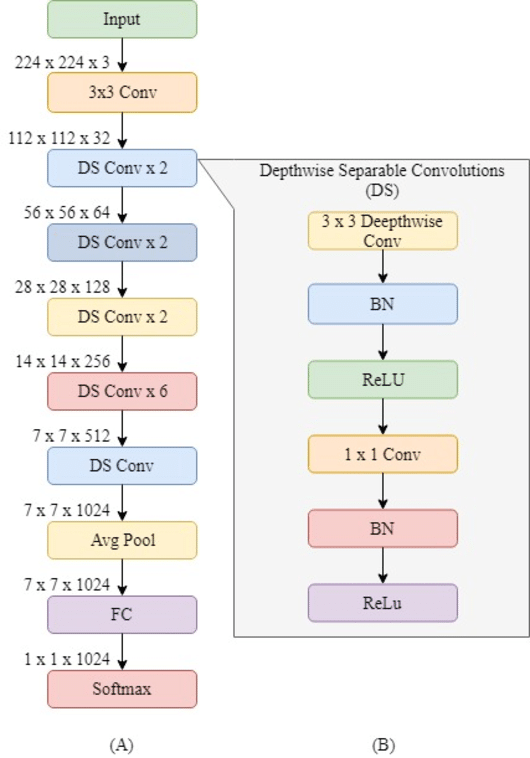

# Emotion-Detection using FER-2013 dataset
## Overview:  
The emotion detection project is built using transfer learning on pre-trained CNN model (i.e. MobileNet) from keras library. The images can be accessed through webcam and detected emotion will be displayed for each frame. 
## Technologies and Library utilized:
- Tensorflow
- Keras
- OpenCV
- Python
- Numpy
## Source of Dataset:
**FER-2013** : The data consists of 48x48 pixel grayscale images of faces. The faces have been automatically registered so that the face is more or less centred and occupies about the same amount of space in each image.The task is to categorize each face based on the emotion shown in the facial expression into one of seven categories (0=Angry, 1=Disgust, 2=Fear, 3=Happy, 4=Sad, 5=Surprise, 6=Neutral). The training set consists of 28,709 examples and the public test set consists of 3,589 examples. (Source : Kaggle)

## Data Pre-processing and EDA:
 Original Image Size: 48X48
 Classes: 7 (0=Angry, 1=Disgust, 2=Fear, 3=Happy, 4=Sad, 5=Surprise, 6=Neutral)
## MobileNet Architecture:

 
Ref: Phiphitphatphaisit, Sirawan & Surinta, Olarik. (2020). Food Image Classification with Improved MobileNet Architecture and Data Augmentation. 

## Model Building:
  Transfer Learning was used with 'Softmax' as activation and 'Adam' as optimizers.Loss was calculated as categorical cross-entropy.
## Project Workflow:(main.py)
 - Important Libraries are imported.
 - Frame is captured using webcam.
 - model is loaded using tensorflow.
 - frame is converted to gray-scaled.
 - Rectangle is drawn around the face using OpenCV.
 - Frame image is converted to required shape.
 - Predict method is called.
 - The emotion which has highest score is displayed over the rectangle.
 - This repeates until 'A' is pressed.
